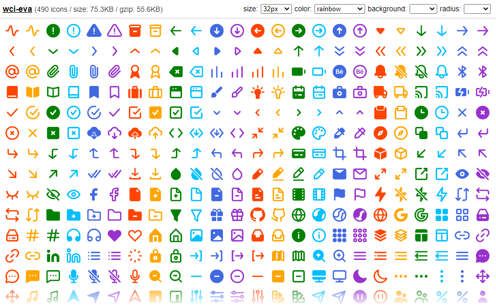

# wci-eva
Built from [eva-icons@1.1.3](https://github.com/akveo/eva-icons)  

490 icons / size: 75.3KB / gzip: 55.6KB  


# Screenshot


Online Page: [https://cenfun.github.io/wci/#eva](https://cenfun.github.io/wci/#eva)

# Features
* Web Components
* Vector SVG Icons 
* Customize Size/Color/Background/Radius
* High Compressed Bundle
# Installation
```sh
npm install wci-eva
```
# API Usage
```js
import { icons, getIcon } from "wci-eva";

const $icon = document.createElement("wci-eva");
$icon.setAttribute("name", "[icon-name]");
$icon.setAttribute("size", "64px");
$icon.setAttribute("color", "#000");
document.body.appendChild($icon);

// get all icons
icons.forEach(item => {
    console.log(getIcon(item.name))
});
```
# Browser Usage
```html

<script src="path-to/wci-eva/dist/wci-eva.js"></script>

<wci-eva name="[icon-name]"></wci-eva>
<wci-eva name="[icon-name]" size="64px" color="#000" style="background:#f5f5f5;"></wci-eva>
```
see [public/index.html](public/index.html)

## Minified with [svg-minifier](https://github.com/cenfun/svg-minifier)
* Optimized with [svgo](https://github.com/svg/svgo)
* Compressed with [lz-string](https://github.com/pieroxy/lz-string)