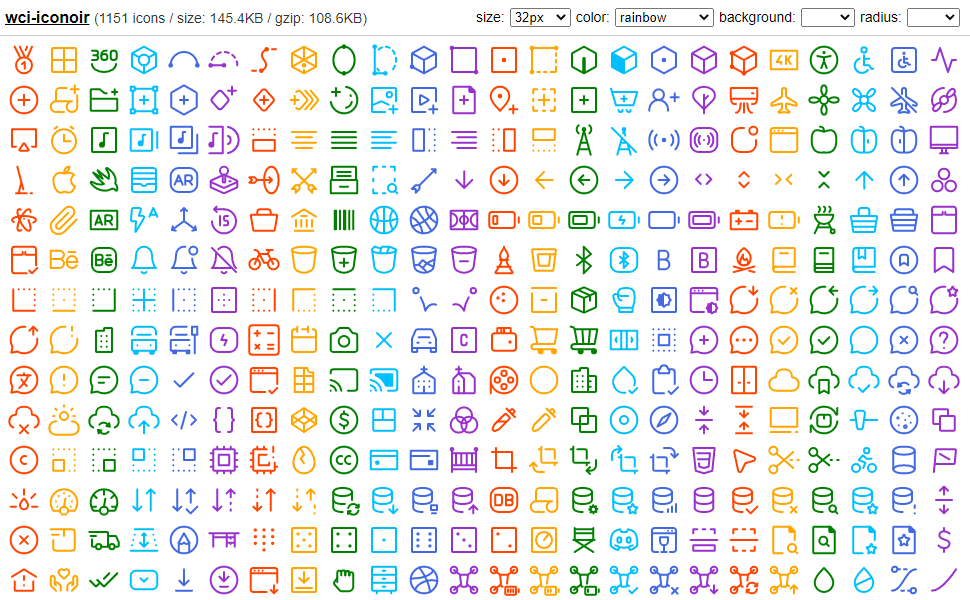

# wci-iconoir
Built from [iconoir@5.0.0](https://github.com/lucaburgio/iconoir)  

1151 icons / size: 146.5KB / gzip: 109.3KB  


# Screenshot


Online Page: [https://cenfun.github.io/wci/#iconoir](https://cenfun.github.io/wci/#iconoir)

# Features
* Web Components
* Vector SVG Icons 
* Customize Size/Color/Background/Radius
* High Compressed Bundle
# Installation
```sh
npm install wci-iconoir
```
# API Usage
```js
import { icon, getIcon } from "wci-iconoir";

const $icon = document.createElement("wci-iconoir");
$icon.setAttribute("name", "[icon-name]");
$icon.setAttribute("size", "64px");
$icon.setAttribute("color", "#000");
document.body.appendChild($icon);

// get all icons
icon.list.forEach(item => {
    const ic = getIcon(item.id);
    console.log(ic)
});
```
# Browser Usage
```html

<script src="path-to/wci-iconoir/dist/wci-iconoir.js"></script>

<wci-iconoir name="[icon-name]"></wci-iconoir>
<wci-iconoir name="[icon-name]" size="64px" color="#000" style="background:#f5f5f5;"></wci-iconoir>
```
see [public/index.html](public/index.html)

## Optimizing and Compression with [svg-to-symbol](https://github.com/cenfun/svg-to-symbol)
* Optimized with [svgo](https://github.com/svg/svgo)
* Removed repeated contents
* Compressed with [lz-string](https://github.com/pieroxy/lz-string)