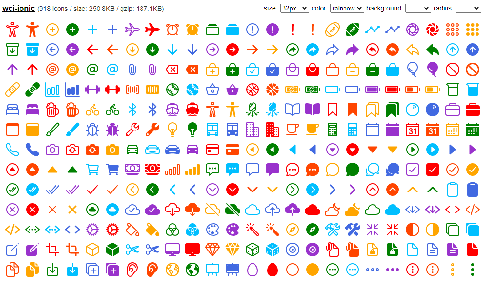

# wci-ionic
Built from [ionicons@6.0.1](https://github.com/ionic-team/ionicons)  

918 icons / size: 250.8KB / gzip: 187.1KB  

No "sharp" icons

# Preview


Online Page: [https://cenfun.github.io/wci/ionic/preview/](https://cenfun.github.io/wci/ionic/preview/)

# Features
* Web Components
* Vector SVG Icons 
* Customize Size/Color/Background/Radius
* High Compressed Bundle
# Installation
```sh
npm install wci-ionic
```
# API Usage
```js
import { icon, getIcon } from "wci-ionic";

const $icon = document.createElement("wci-ionic");
$icon.setAttribute("name", "[icon-name]");
$icon.setAttribute("size", "64px");
$icon.setAttribute("color", "#000");
document.body.appendChild($icon);

// get all icons
icon.list.forEach(item => {
    const ic = getIcon(item.id);
    console.log(ic)
});
```
# Browser Usage
```html

<script src="path-to/wci-ionic/dist/wci-ionic.js"></script>

<wci-ionic name="[icon-name]"></wci-ionic>
<wci-ionic name="[icon-name]" size="64px" color="#000" style="background:#f5f5f5;"></wci-ionic>
```
see [preview/index.html](preview/index.html)

## Optimizing and Compression with [svg-to-symbol](https://github.com/cenfun/svg-to-symbol)
* Optimized with [svgo](https://github.com/svg/svgo)
* Removed repeated contents
* Compressed with [lz-string](https://github.com/pieroxy/lz-string)