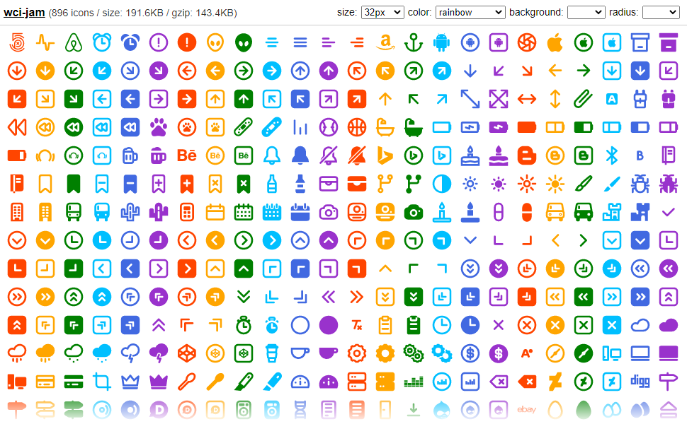

# wci-jam
Built from [jam-icons@2.0.0](https://github.com/michaelampr/jam)  

896 icons / size: 191.6KB / gzip: 143.4KB  


# Screenshot


Online Page: [https://cenfun.github.io/wci/#jam](https://cenfun.github.io/wci/#jam)

# Features
* Web Components
* Vector SVG Icons 
* Customize Size/Color/Background/Radius
* High Compressed Bundle
# Installation
```sh
npm install wci-jam
```
# API Usage
```js
import { icons, getIcon } from "wci-jam";

const $icon = document.createElement("wci-jam");
$icon.setAttribute("name", "[icon-name]");
$icon.setAttribute("size", "64px");
$icon.setAttribute("color", "#000");
document.body.appendChild($icon);

// get all icons
icons.forEach(item => {
    console.log(getIcon(item.name))
});
```
# Browser Usage
```html

<script src="path-to/wci-jam/dist/wci-jam.js"></script>

<wci-jam name="[icon-name]"></wci-jam>
<wci-jam name="[icon-name]" size="64px" color="#000" style="background:#f5f5f5;"></wci-jam>
```
see [public/index.html](public/index.html)

## Minified with [svg-minifier](https://github.com/cenfun/svg-minifier)
* Optimized with [svgo](https://github.com/svg/svgo)
* Compressed with [lz-string](https://github.com/pieroxy/lz-string)