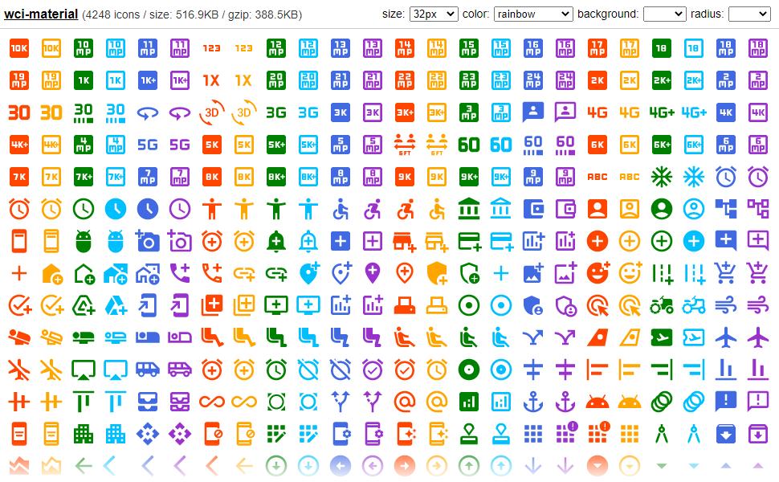

# wci-material
Built from [@material-design-icons/svg@0.11.3](https://github.com/marella/material-design-icons)  

4248 icons / size: 516.9KB / gzip: 388.5KB  

No sharp/round/two-tone icons

# Screenshot


Online Page: [https://cenfun.github.io/wci/#material](https://cenfun.github.io/wci/#material)

# Features
* Web Components
* Vector SVG Icons 
* Customize Size/Color/Background/Radius
* High Compressed Bundle
# Installation
```sh
npm install wci-material
```
# API Usage
```js
import { icons, getIcon } from "wci-material";

const $icon = document.createElement("wci-material");
$icon.setAttribute("name", "[icon-name]");
$icon.setAttribute("size", "64px");
$icon.setAttribute("color", "#000");
document.body.appendChild($icon);

// get all icons
icons.forEach(item => {
    console.log(getIcon(item.name))
});
```
# Browser Usage
```html

<script src="path-to/wci-material/dist/wci-material.js"></script>

<wci-material name="[icon-name]"></wci-material>
<wci-material name="[icon-name]" size="64px" color="#000" style="background:#f5f5f5;"></wci-material>
```
see [public/index.html](public/index.html)

## Minified with [svg-minifier](https://github.com/cenfun/svg-minifier)
* Optimized with [svgo](https://github.com/svg/svgo)
* Compressed with [lz-string](https://github.com/pieroxy/lz-string)