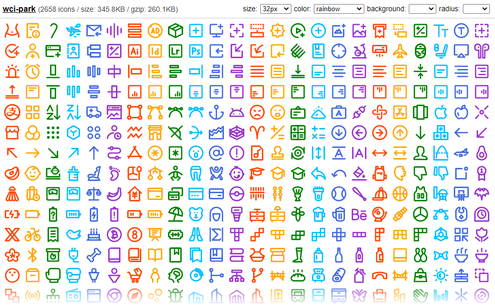

# wci-park
Built from [@icon-park/svg@1.4.1](https://github.com/bytedance/IconPark)  

2658 icons / size: 345.8KB / gzip: 260.1KB  


# Screenshot


Online Page: [https://cenfun.github.io/wci/#park](https://cenfun.github.io/wci/#park)

# Features
* Web Components
* Vector SVG Icons 
* Customize Size/Color/Background/Radius
* High Compressed Bundle
# Installation
```sh
npm install wci-park
```
# API Usage
```js
import { icons, getIcon } from "wci-park";

const $icon = document.createElement("wci-park");
$icon.setAttribute("name", "[icon-name]");
$icon.setAttribute("size", "64px");
$icon.setAttribute("color", "#000");
document.body.appendChild($icon);

// get all icons
icons.forEach(item => {
    console.log(getIcon(item.name))
});
```
# Browser Usage
```html

<script src="path-to/wci-park/dist/wci-park.js"></script>

<wci-park name="[icon-name]"></wci-park>
<wci-park name="[icon-name]" size="64px" color="#000" style="background:#f5f5f5;"></wci-park>
```
see [public/index.html](public/index.html)

## Minified with [svg-minifier](https://github.com/cenfun/svg-minifier)
* Optimized with [svgo](https://github.com/svg/svgo)
* Compressed with [lz-string](https://github.com/pieroxy/lz-string)