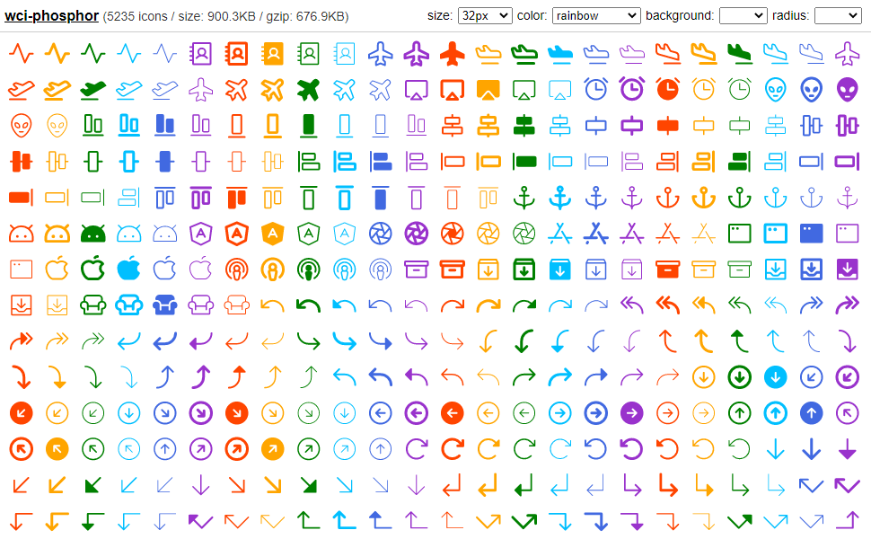

# wci-phosphor
Built from [phosphor-icons@1.4.2](https://github.com/phosphor-icons/phosphor-icons)  

5235 icons / size: 900.3KB / gzip: 676.9KB  


# Preview


Online Page: [https://cenfun.github.io/wci/#phosphor](https://cenfun.github.io/wci/#phosphor)

# Features
* Web Components
* Vector SVG Icons 
* Customize Size/Color/Background/Radius
* High Compressed Bundle
# Installation
```sh
npm install wci-phosphor
```
# API Usage
```js
import { icon, getIcon } from "wci-phosphor";

const $icon = document.createElement("wci-phosphor");
$icon.setAttribute("name", "[icon-name]");
$icon.setAttribute("size", "64px");
$icon.setAttribute("color", "#000");
document.body.appendChild($icon);

// get all icons
icon.list.forEach(item => {
    const ic = getIcon(item.id);
    console.log(ic)
});
```
# Browser Usage
```html

<script src="path-to/wci-phosphor/dist/wci-phosphor.js"></script>

<wci-phosphor name="[icon-name]"></wci-phosphor>
<wci-phosphor name="[icon-name]" size="64px" color="#000" style="background:#f5f5f5;"></wci-phosphor>
```
see [preview/index.html](preview/index.html)

## Optimizing and Compression with [svg-to-symbol](https://github.com/cenfun/svg-to-symbol)
* Optimized with [svgo](https://github.com/svg/svgo)
* Removed repeated contents
* Compressed with [lz-string](https://github.com/pieroxy/lz-string)