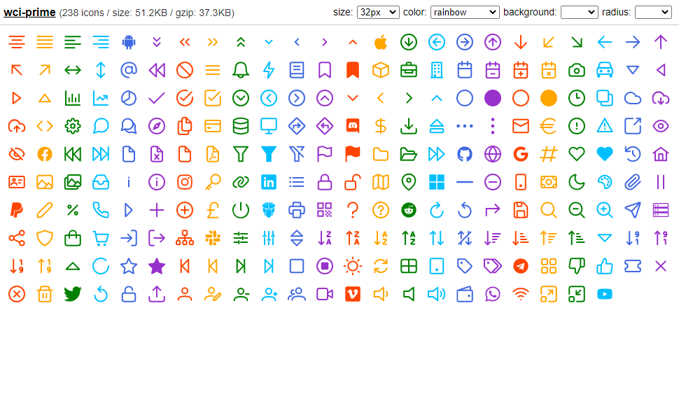

# wci-prime
Built from [primeicons@5.0.0](https://github.com/primefaces/primeicons)  

238 icons / size: 50.1KB / gzip: 36.6KB  


# Screenshot


Online Page: [https://cenfun.github.io/wci/#prime](https://cenfun.github.io/wci/#prime)

# Features
* Web Components
* Vector SVG Icons 
* Customize Size/Color/Background/Radius
* High Compressed Bundle
# Installation
```sh
npm install wci-prime
```
# API Usage
```js
import { icons, getIcon } from "wci-prime";

const $icon = document.createElement("wci-prime");
$icon.setAttribute("name", "[icon-name]");
$icon.setAttribute("size", "64px");
$icon.setAttribute("color", "#000");
document.body.appendChild($icon);

// get all icons
icons.forEach(item => {
    console.log(getIcon(item.name))
});
```
# Browser Usage
```html

<script src="path-to/wci-prime/dist/wci-prime.js"></script>

<wci-prime name="[icon-name]"></wci-prime>
<wci-prime name="[icon-name]" size="64px" color="#000" style="background:#f5f5f5;"></wci-prime>
```
see [public/index.html](public/index.html)

## Minified with [svg-minifier](https://github.com/cenfun/svg-minifier)
* Optimized with [svgo](https://github.com/svg/svgo)
* Compressed with [lz-string](https://github.com/pieroxy/lz-string)